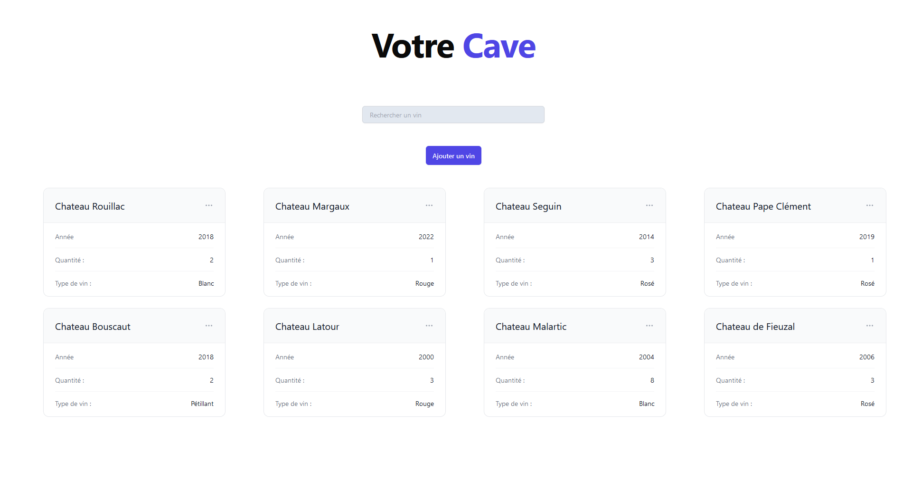

# WineService

Bienvenue sur le projet **WineService** ! Ce projet utilise les technologies React pour le front-end, Tailwind CSS pour le style, et Express pour le back-end.

## Table des Matières

- [Aperçu](#aperçu)
- [Fonctionnalités](#fonctionnalités)
- [Installation](#installation)
- [Utilisation](#utilisation)
- [Structure du Projet](#structure-du-projet)

## Aperçu

Voici une capture d'écran de l'interface utilisateur :



## Fonctionnalités

- Interface utilisateur réactive et moderne avec React
- Style personnalisé et rapide grâce à Tailwind CSS
- Serveur backend puissant avec Express
- Routes d'API sécurisées et robustes
- Gestion des états centralisée avec Redux (optionnel)

## Installation

### Prérequis

- Node.js (version 14 ou supérieure)
- npm ou yarn

### Étapes d'installation

1. Clonez le dépôt :

   ```bash
   git clone https://github.com/Goune1/WineService.git
   cd mon-super-site-web

2. Installez les dépendances pour le front-end et le back-end :

   ```bash
   cd client
   npm install -D tailwindcss postcss autoprefixer axios react-router-dom @headlessui/react @heroicons/react js-cookie
   cd ../server
   npm i express path bcrypt cookie-parser express-session mongoose nodemailer connect-mongodb-session cors axios body-parser  

## Utilisation

### Lancer le Front-End 

1. Aller dans le répertoire du client

   ```bash
   cd client

2. Lancer l'application React

   ```bash
   npm start

### Lancer le Back-End

1. Aller dans le répertoire du serveur

   ```bash
   cd ../server

2. Lancer le serveur

   ```bash
   node index.js

## Structure du Projet

   ```plaintext
   wineservice/
   ├── client/             # Code du front-end React
   │   ├── public/
   │   ├── src/
   │   │   ├── components/
   │   │   ├── pages/
   │   │   ├── App.jsx
   │   │   ├── main.jsx
   │   │   ├── index.css
   │   │   └── ...
   │   ├── .eslintrc.cjs
   │   ├── index.html
   │   ├── package-lock.json
   │   ├── package.json
   │   ├── postcss.config.js
   │   ├── README.md
   │   ├── tailwind.config.js
   │   ├── vercel.json
   │   ├── vite.config.js
   │   └── ...
   ├── server/             # Code du back-end Express
   │   ├── schemas/
   │   ├── index.js
   │   ├── package-lock.json
   │   ├── package.json
   │   ├── vercel.json
   │   └── ... 
   └── README.md
